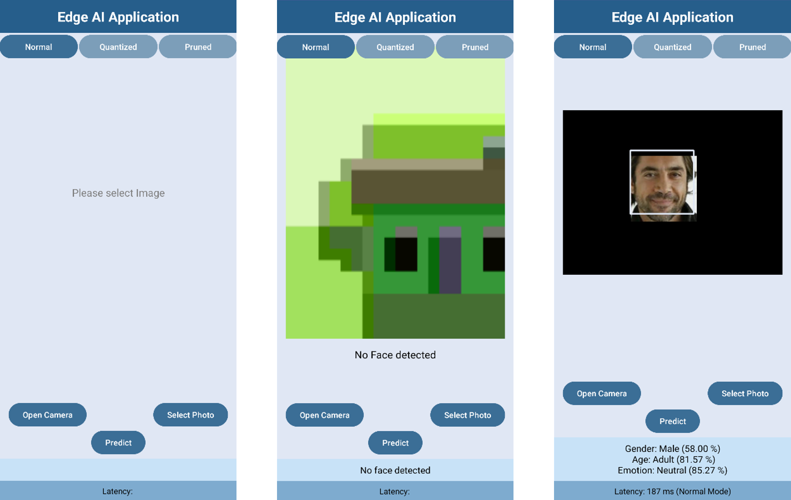

# ProjEdgeAI
This repo contains the files for the Project EdgeAI for my studies Applied Artificial Intelligence at IU International University. It consists of a mobile application for Android, which should detect faces and classify them in terms of age, gender and emotion.

---

## Structure:
📂 /Application: Source Code for Android Studio with all necessary assets 
📂 /Classification: Source Code for Training and Testing the Deep Learning Models as well as the preprocessing steps, which were undertaken locally.

---

## Application:

The UI of the application is shown in the following picture: 

The application allows the selection of an image from the camera or gallery. The predictions can be done with three different models: the converted tf-lite file, the quantizied model and the pruned and quantizied model. The prediction will appear after pressing the predict button. 
Please note that only one face per image will be classified (the biggest one detected), which is highlighted with a rectangle. 
